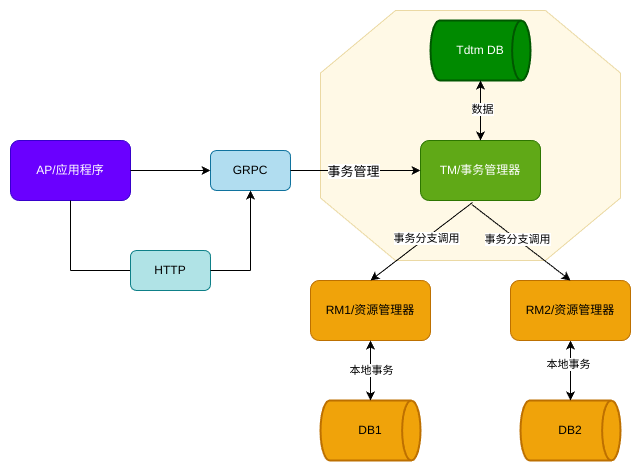

## Tdtm

Tdtm 是一个支持两阶段提交协议的分布式事务框架，它目前提供 saga、tcc 两种模式。


### Tdtm 架构



整个架构中，一共有三个角色，分别承担了不同的功能：

- TM-事务管理器：TM 负责管理分布式事务。每个事务在开始时都会先向 TM 注册，TM 负责协调所有的 RM，确保一组事务要么全部成功提交，要么全部回滚，以保持数据一致性。
- RM-资源管理器：RM 是应用服务，负责管理分布式事务中的本地事务，处理涉及的数据修改、提交、回滚以及补偿等操作。
- AP-应用程序：AP 是一个应用服务，主要负责全局事务的编排工作，并向 TM 注册全局事务，以保证整个事务的顺利进行。

### 设计

AP 使用了 gRPC-Gateway，以实现 gRPC 和 HTTP 双协议支持，使得外部系统可以通过 HTTP 调用，同时内部服务使用高效的 gRPC 进行通信。

TM 在事务的执行过程中，etcd 用于提供服务发现功能，通过 MySQL 持久化事务状态，使用 gRPC 与 RM 进行事务分支调用。

每个 RM 控制一个数据库实例，负责执行本地事务操作，并向 TM 汇报事务状态，根据 TM 的决策进行最终的提交或回滚操作。

### 模型


SAGA 的核心思想是将长事务拆分为多个短事务，如果每个短事务都成功提交，则全局事务成功，如果某个步骤失败，则根据反向调用补偿操作，全局事务失败。


TCC 的相对于 SAGA 增加 try 阶段，完成所有业务检查，如果全部成功则进入 Confirm 阶段，如果有一个失败而进行 Cancel 阶段

### 运行

你可以根据自己的需要修改 conf.yml 文件
```yml
...
db:
  driver: mysql
  mysql:
    dbURL: user:password@tcp(127.0.0.1:3306)/db?charset=utf8mb4&parseTime=True&loc=Local
    maxLifetime: 7200
    maxIdleConns: 10
    maxOpenConns: 
```

运行 Tdtm 服务器
```sh
go run cmd/main.go
```

### LICENSE
本项目所有代码使用 Apache 2.0 进行许可。
